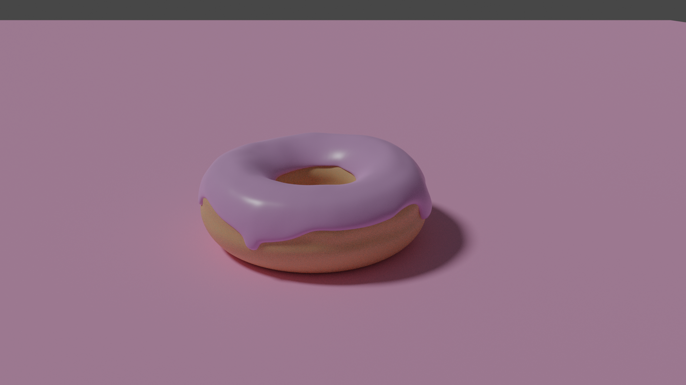
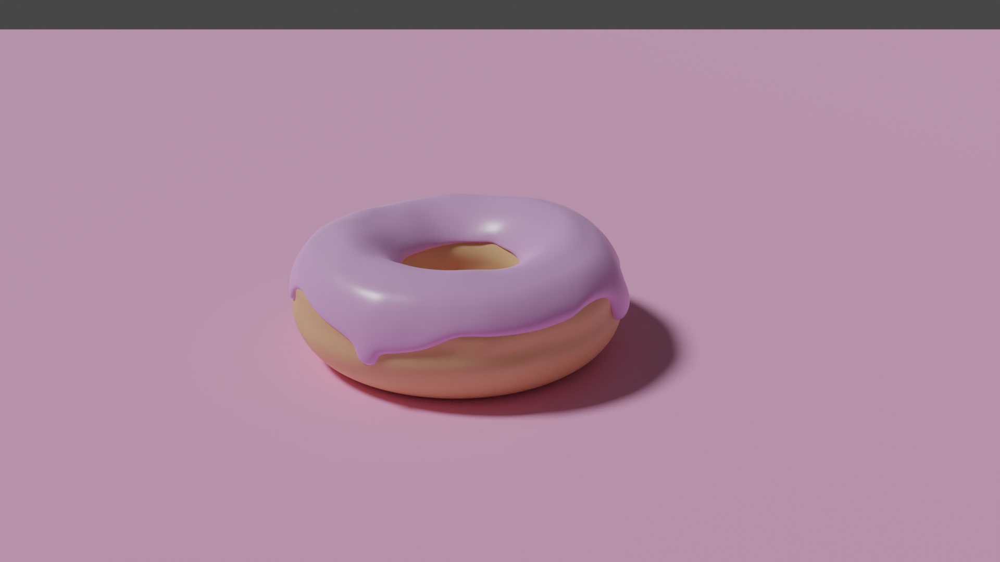
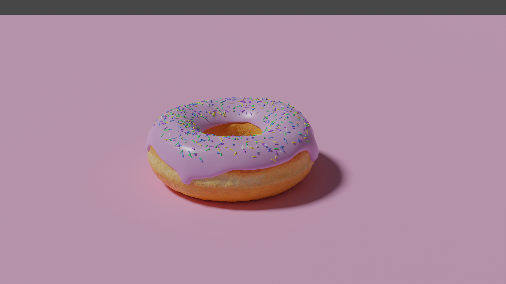
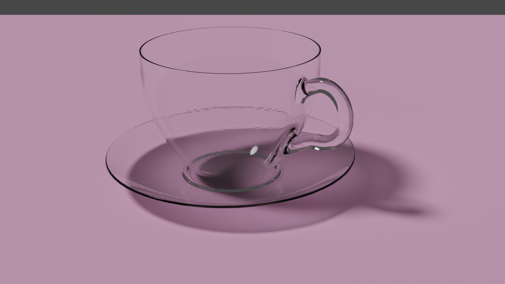
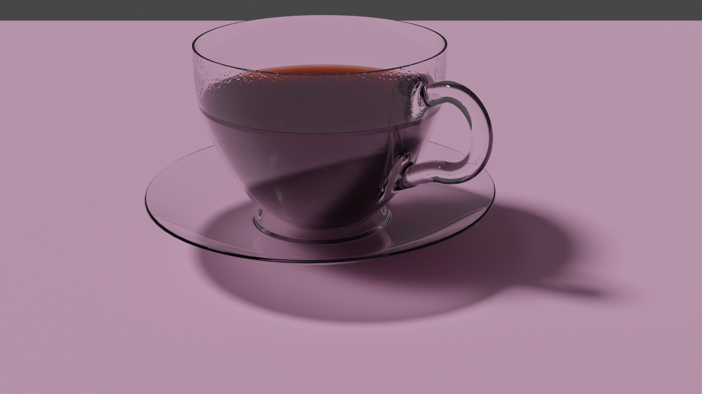

### Blender Donut

Follow-along tutorial from [Blender Guru](https://www.youtube.com/playlist?list=PLjEaoINr3zgEq0u2MzVgAaHEBt--xLB6U) modelling and rendering a donut.

##### End of Level 1, colour only material, basic lighting.

Before denoise filter:

After denoise filter:

End of Level 2, all the nodes!

##### Start of Level 3, empty glass cup and saucer.

##### End of Level 3, coffee with condensation

Not included in repo is the [normal map](https://www.dropbox.com/s/9j6m709qmu4bfvz/WaterDropletsMixedBubbled001_NRM16_1K.tif?dl=0) for the condensation courtesy of [Blender Guru](https://www.blenderguru.com/) and [Poliigon](https://www.poliigon.com/)