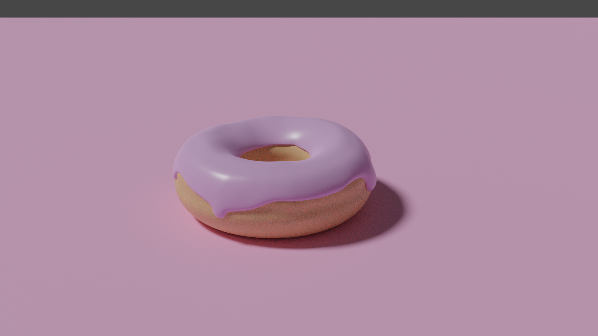

### Blender Donut

Follow-along tutorial from [Blender Guru](https://www.youtube.com/playlist?list=PLjEaoINr3zgEq0u2MzVgAaHEBt--xLB6U) modelling and rendering a donut.

End of Level 1, colour only material, basic lighting.

Before denoise filter:

After denoise filter:

End of Level 2, all the nodes!

